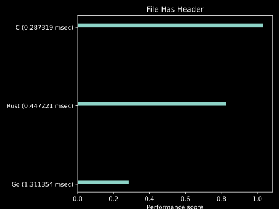
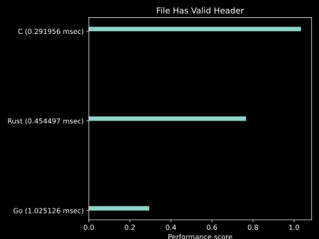
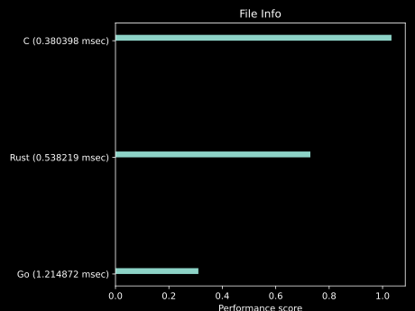

<h1><b>Cryptdatum Format Specification v1</b></h1>
<h2>Public Working Draft</h2>

---

**Authors:**

*[Marko Kungla](https://github.com/mkungla)*

|              |              |
| ------------ | ------------ |
| **Date:**    | *10.05.2022* |
| **Updated:** | *03.01.2023* |
| **Version:** | *0.4.16* |

<h2>Table Of Contents</h2>

- [Introduction](#introduction)
- [Design](#design)
- [Cryptdatum Header Format](#cryptdatum-header-format)
  - [Header Structure](#header-structure)
  - [Byte Ordering](#byte-ordering)
  - [Constants](#constants)
  - [Enums](#enums)
  - [Header validation](#header-validation)
- [Checksum](#checksum)
- [Compression](#compression)
- [File extension](#file-extension)
- [Implementation Benchmarks](#implementation-benchmarks)


## Introduction

The Cryptdatum format is a simple, lightweight format for storing data to be long term compatible with many encryption and compression algorithms. It consists of a 80-byte header followed by the data payload or 80-byte header followed by the signature and then data payload in case when data is signed. Cryptdatum is designed to be flexible enough to accommodate a variety of use cases, while still maintaining simplicity.

Cryptdatum can be used to store and transmit data fast. The format includes a number of features to ensure the security and integrity of the data, including builtin checksumming and optional encryption, compression and signing.

## Design

The Cryptdatum (CDT) format consists of a 80-byte header followed by the payload. The header contains metadata about the data, including a magic number, version number, timestamp, operation counter, checksum, flags, total size of datum, compression algorithm (if used), encryption algorithm if data is ecrypted which case it will also have Signature Size field set to indicate size of signature after header so that it is easier determine actual start of payload.


**Contents of the header**

The magic number is an 8-byte value that identifies the header as a Cryptdatum header. It helps to prevent the header from being mistaken for data belonging to another format.

The version number is a 2-byte value that indicates the version of the Cryptdatum format used to encode the data. This allows the format to evolve over time without breaking backwards compatibility.

The flags are a 8 byte flag bits value that can be used to indicate whether the data is encrypted, compressed, or has other supported feature enabled. Other flags may be added in the future.

The timestamp is an 8-byte value that contains a Unix timestamp in nanoseconds, indicating the time when the data was created. It can be used to order data by creation time and to determine the age of the data.

The operation counter is a 4-byte value that can be used to assign a unique operation ID to the data when multiple datums are created with the same timestamp. This helps to ensure that each datum has a unique identifier, even when the timestamps are the same. It can be used to differentiate between multiple operations that produced that datum and were executed in parallel. When used Flag bits (16) must be set and minimum value is unsigned integer 1.

The checksum is an 8-byte value that contains a CRC64 checksum, which is used to verify the integrity of the data. If the checksum does not match the data, it is likely that the data has been corrupted or tampered with.

The size field is an 8-byte value that contains the total size of the data, including the header. This helps to ensure that the entire data payload has been received. It allows the decoder to know how much data to read in order to fully decode the Cryptdatum.

The compression flag is a 2-byte value that indicates which compression algorithm was used, if any. It is only set if the DatumCompressed flag is set. Currently, only the LZW, gzip and bzip2 algorithms are currently supported.

The encryption flag is a 2-byte value that indicates which encryption algorithm was used, if any. It is only set if the DatumEncrypted flag is set. Currently, the Cryptdatum format supports the XChaCha20-Poly1305 encryption algorithm, but the format is designed to be flexible enough to accommodate other algorithms in the future.

The signature type  flag is a 2-byte value that indicates what mechanism was used for signing the datum if it is signed.

The Signature Size field is an 8-byte value that contains the total size of the signature after header for faster lookup of signature data and start location of the payload. Value of this field depends on signature type field and therefore may not be set for some signing methods.

The File Extension can be max 8 char long file extension accociated with payload. In ASCII, each character is represented by a single byte, and there are a total of 95 printable ASCII characters. These characters include uppercase and lowercase letters, digits, and various punctuation marks and symbols. Therefore values in the range 32 to 126 inclusive can be used. with exception of 0 for no value. 

The Custom field is a value that implementations and higher lkevel librareis can add custom meetadata or aditional context.

The delimiter is an 8-byte value that marks the end of the header. It helps to prevent the header from being misinterpreted as part of the data payload. It is also used to ensure that the header is properly parsed by the decoder.

**Payload**

The payload is the data being encoded, following the header. It can be of any length and can contain any type of data.

## Cryptdatum Header Format

The Cryptdatum header is a 80-byte block of data that contains metadata about the data payload. It is used to identify the data as a Cryptdatum datum, as well as to indicate the features that are used by the datum.

### Header Structure

The Cryptdatum header consists of the following fields:

| Field                 | Value Type                | Size (bytes) | Description |
| --------------------- | ------------------------- | ------------ |  ---------- |
| Magic                 | byte array                | 8            | Identifies the header as a Cryptdatum header. |
| Version               | unsigned integer (uint16) | 2            | Indicates the version of the Cryptdatum format. |
| Flags                 | unsigned integer (uint64) | 8            | Cryptdatum format features flags to indicate which Cryptdatum features are used by that datum e.g whether the data is encrypted, compressed, or has a checksum. has operation counter set is signed etc. |
| Timestamp             | unsigned integer (uint64) | 8            | Unix timestamp in nanoseconds, indicating the time when the data was created.  |
| OPC                   | unsigned integer (uint32) | 4            | Operation Counter - Unique operation ID for the data. |
| Size                  | unsigned integer (uint64) | 8            | Total size of the data, including the header and optional signature. Eg. useful for parsers, decoders,encoders to prealocate requirexd resourced to be able to process the datum  |
| Checksum              | unsigned integer (uint64) | 8            | CRC64 checksum for verifying the integrity of the data. |
| Compression Algorithm | unsigned integer (uint16) | 2            | Indicates the compression algorithm used, if any. |
| Encryption Algorithm  | unsigned integer (uint16) | 2            | Indicates the encryption algorithm used, if any. |
| Signature Type        | unsigned integer (uint16) | 2            | Indicates the signature type helping implementations to idendify how the signature should be verified. |
| Signature Size        | unsigned integer (uint32) | 4            | Indicates the size of the signature, if any. |
| File Extension        | byte array                | 8            | can be set as maximum 8 byte ASCII printable character secuence with values 32 to 126 inclusive or 0 for no value. |
| Custom                | byte array                | 8            | Custom 8 byte field can used by implementations for adding additional context or metadata. |
| Delimiter             | byte array                | 8            | Magic value that marks the end of the header. |


This flag indicates that Cryptdatum conatins payload and the underlying payload format metadata is set do decide how do decode the payload. Metadata can be read from first 16 bytes of the payload. This means that in case of encrypted datum, metadata is available after datum is decrypted. However datum metadata is not compressed so it can be accessed before decompressing the datum.

### Byte Ordering

All multi-byte values in the Cryptdatum header are stored in little endian byte order. This means that the least significant byte (LSB) is stored at the lowest memory address, and the most significant byte (MSB) is stored at the highest memory address. That enables modern hardware, access to individual header bytes more efficiently.

### Constants
 
 - **Version** for implementation of current version of Cryptdatum format shoud set that value to 1 as unsigned integer (uint16)   
 - **Magic Number** is fixed byte array `0xA7, 0xF6, 0xE5, 0xD4, 0xC3, 0xB2, 0xA1, 0xE1`
    if the Magic Number field is not recognized and matched at the beginning of the header, the header should be considered invalid.
 - **Delimiter** `0xC8, 0xB7, 0xA6, 0xE5, 0xD4, 0xC3, 0xB2, 0xF1`
    if the Delimiter field is not recognized and matched at the end (last 8 bytes) of the header, the header should be considered invalid.

### Enums

- **Flags** header field value can be set with one byte DatumFlag enums. DatumFlag is bitmask set of booleans represented by the bits in a single number.
  Following DatumFlags have been defined by current specification and can be applied to Flag header field; DatumFlags keep backward compability promise and future revisons may only append new DatumFlags while modification of exisiting ones is forbitten.
	- **DatumInvalid (1)** When Cryptdatum format is correct, but payload data is considered invalid.
	- **DatumDraft (2)** This flag is set when datum is in draft state, therefore it's values can not be trusted.
  - **DatumEmpty (4)**: This flag indicates that Cryptdatum does not contain any payload.
  - **DatumChecksum (8)** Indicates that checksum is calculated and checksum value is avaliable in Checksum header field.
  - **DatumOPC (16)** Indicates that datum has operation counter value set in header (opc). which is useful for datum ordering when multiple datums have been creating with same timestamp. e.g. in case of parallel processing.
  - **DatumCompressed (32)** Indicates that datum payload is compressed and algorithm used for compression can be looked up from Compression Algorithm header field.
  - **DatumEncrypted (64)** Indicates that datum payload is encrypted and algorithm used for encryption can be looked up from Encryption Algorithm header field.
  - **DatumExtractable (128)**  File Extension field must be also set using this flag. That indicates that payload can be extracted to file with extension defined in File Extension header field. This allows to offload post processing of the payload to other interpreters accociated with the file extension. While such payload still can use Cryptdatum compression and encryption algorithms it provides extreamly high flexibility to offload also that to external program. E.g. Cryptdatum can hold as payload already compressed and encrypted data which case using Crypdatum compression and encryption algorithms would not make much sense, nut you still may want to leverage Cryptdatum's signing and checksum features.
  - **DatumSigned (256)** Indicates that datum has been signed, That case  Signature Type header field can be used to look up the signature type to decide how the signature can be verified. When Signature Size field is also set to value greater than 0 it will indicate that signature is included in datum and signature size length in bytes so that it can be extracted from between header and actual payload. Such case format would be in follwoing order.
	```
	|----------------|---------------------------|----------------|
	| Header         | Signature byte array      | Payload        |
	```
  - **DatumStreamable (512)** Indicates that datum payload is streamable and can be decoded  from stream reasource when reciever has appropiate support for such decoder. DatumStreamable is used together with atleast some compression algortihm or encryption algorithm or both combined.  While underlying decoder and encoder may have own mechanism how to verify idividual packets or chunks processed the final complete payload still MUST pass the integrity check of the checksum.
  - **DatumCustom (1024)** Arbitrary metadata, Cryptdatum does not care about the value of this field and allows higher level libraries to use it as the wich, however it is part of the checksumed data. 
  - **DatumCompromised (2048)** Indicates that remote source providing the datum has readons to belive that integrity of Cryptdatums payload can not be verified, e.g failed checksum check, invalid signature etc. Receiver should be extremely cautious when processing such Cryptdata payload. Meaning of this field very vague and interpretation may vary based on individual use-cases. Source providing such Cryptum may provide additional context why Datum Compromised flag has been set but that behaviour is not part of this specification and implementations may create custom behaviour around that Flag.
	
### Header validation

- For default values, for reserved fields and padding `0x00` byte should be used. 
- Version Number must be less than or equal to the lates specification version. Implementations may limit the range of the version supported, which case concise and clear error should be returned to user indication that Cryptdatum version is out of supported range. 
- When validation of **Magic** or **Delimiter** validation fails, the simple unsupported format can error can be returned.
- All other cases when validation of other header fields fail the invalid Header Invalid error should be returned, optionally providing additional context what validation failed and portetially hinting user how to resolve that error.

## Checksum

The checksum Header Field is an 8-byte value that is used to verify the integrity of the data. It is calculated using the CRC64 algorithm, which produces a unique checksum for a given data set.

The checksum is calculated by taking the following values as input:
If the data is signed, the signature is not used as part of the checksum calculation.

| Field                 | Description                       |
| --------------------- | --------------------------------- |
| **Version**           | 2-byte value                      |
| **Timestamp**         | 8-byte value                      |
| **Operation Counter** | 2-byte value                      |
| **Flags**             | 1-byte value.                     |
| **Data Payload**      | Variable-length payload in datum. (including metadata) |

The CRC64 algorithm with ISO polynomial, defined in ISO 3309 and used in HDLC, is applied to these values to generate a 64-bit checksum value. This value is then stored in the checksum field of the header.

When the data is received, the checksum is recalculated and compared to the value stored in the header. If the checksums do not match, it is likely that the data has been corrupted or tampered with.

The checksum can be used to detect errors in the transmission of the data, as well as to ensure that the data has not been modified by an unauthorized party. It is an important security measure that helps to ensure the integrity of the data.

When payload is encrypted and signed then signature data is omitted when calculating checksum. Header field Signature Size helps with to quickly idendify signature bytes and find a beginning of the payload.


## Compression

Cryptdatum supports data compression to reduce the size of the data payload and improve transmission efficiency. Compression is optional and can be enabled or disabled using the DatumCompressed flag in the header.

The Cryptdatum uses most at the moment the LZW algorithm for data compression. The LZW algorithm is a lossless data compression algorithm that uses a dictionary to encode repeating patterns in the data. It is fast and efficient, making it well-suited for use in Cryptdatum current use-case.

To compress data with Cryptdatum, the data is first passed through the LZW compression algorithm, which produces a compressed representation of the data. The DatumCompressed flag is then set in the header, and the compressed data is stored in the payload.

To decompress data that has been compressed with Cryptdatum, the DatumCompressed and flag is checked in the header. If the flag is set, the data is passed through the LZW decompression algorithm to reconstruct the original data. If the flag is not set, the data is returned as-is, as it was not compressed.

## File extension

The .cdt file extension is used to store data in the Cryptdatum (CDT) format.
A Cryptdatum file consists of a 80-byte header followed by data (payload).

## Implementation Benchmarks

**Following Benchmarks contain performance metrics score which indicate better performance when the value is HIGHER. Score is calculated as standard deviation of the metric values and scaled to range 1-(0.1-1.0) relative to other languages**

- **`cpu-clock`**: This event measures the total amount of time that the program spent executing on the CPU.
- **`task-clock`**: This event measures the total amount of time that the program spent executing on the CPU, including time spent executing in the kernel on behalf of the program.
- **`cache-misses`**: This event measures the number of times that the program accessed memory that was not present in the cache. The cache is a high-speed memory that stores frequently accessed data, and a cache miss occurs when the program has to access main memory instead.
- **`branch-misses`**: This event measures the number of times that the program predicted the outcome of a branch instruction incorrectly and had to perform an extra jump to the correct location in the code.
- **`context-switches`**: This event measures the number of times that the program was suspended and another program was scheduled to run on the CPU.
- **`stability`**: Benchmarks are executed n times (e.g. 100). The Stablity reports total variance of these results and high score indicates that application was more stable compared to other languages.
- **`stability`**: Benchmarks are executed n times (e.g. 100). The Stablity reports total variance of these results and high score indicates that application was more stable compared to other languages.
- **`cpu-cycles`**: This counts the number of CPU cycles executed by the program.
- **`instructions`**: This counts the number of instructions executed by the program.

| | |
| --- | --- |
| ***Figure 1.** Performing minimal check to verify is external file containing Cryptdatum header* | ***Figure 2.** Performing minimal check to verify is external file containing valid Cryptdatum header* |
|  |  |
| ***Figure 3.** Print basic file info* | |
|  | |
